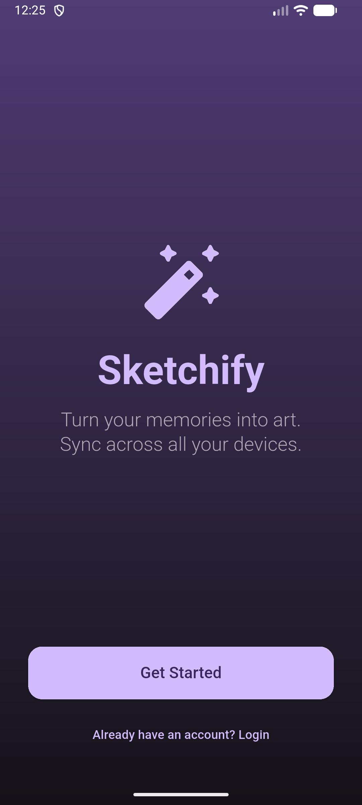
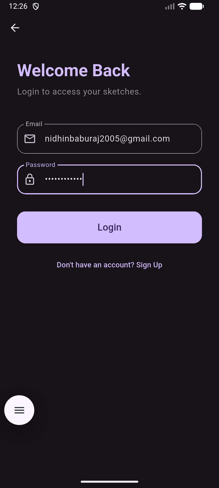
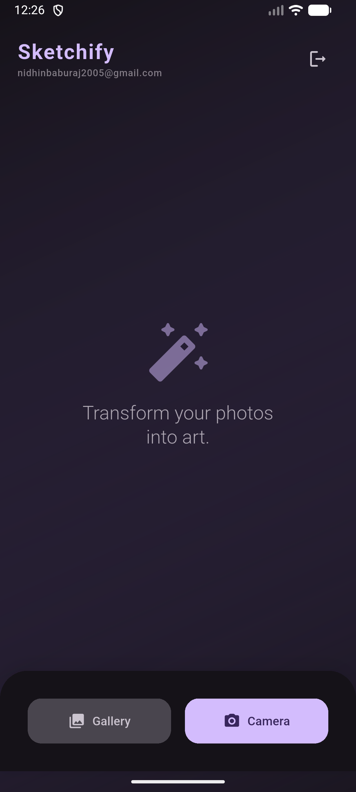

# ✨ Sketchify

**Turn your memories into art. Sync across all your devices.**

Sketchify is a premium Flutter application that transforms your ordinary photos into stunning pencil sketches using advanced image processing. With built-in Firebase synchronization, your artistic creations are always available, no matter which device you're using.


## 🚀 Features

- **🎨 Photo-to-Sketch Magic**: Instantly convert any gallery image or camera snap into a high-quality pencil sketch.
- **🎚️ Precision Control**: Fine-tune the "Intensity" of the sketch effect with a real-time slider to get the perfect look.
- **☁️ Cloud Sync**: Secure authentication via Firebase Auth allows you to access your experience across multiple devices.
- **💾 Save & Share**: Export your masterpieces directly to your gallery or share them with friends and family via social apps.
- **🛡️ Modern UI/UX**: A sleek, dark-themed Material 3 interface designed for a premium user experience.

## 🛠️ Tech Stack

- **Framework**: [Flutter](https://flutter.dev/) (Multi-platform UI toolkit)
- **Backend**: [Firebase](https://firebase.google.com/) (Authentication & Core services)
- **Image Processing**: Custom Dart implementation (Grayscale, Gaussian Blur, Color Dodge blending)
- **Plugins**: `image_picker`, `share_plus`, `gal`, `path_provider`

## 🏁 Getting Started

### Prerequisites

- Flutter SDK (>= 3.0.0)
- Android Studio / VS Code
- A Firebase project

### Installation

1. **Clone the repository:**
   ```bash
   git clone https://github.com/yourusername/sketchify.git
   cd sketchify
   ```

2. **Install dependencies:**
   ```bash
   flutter pub get
   ```

3. **Firebase Setup:**
   - Create a new project in the [Firebase Console](https://console.firebase.google.com/).
   - Add an Android/iOS app to your Firebase project.
   - Download the `google-services.json` (for Android) or `GoogleService-Info.plist` (for iOS) and place them in the appropriate directories.
   - Enable **Email/Password** authentication in the Firebase Auth section.

4. **Run the app:**
   ```bash
   flutter run
   ```

## 📸 Screenshots

| Landing Page | Authentication | Sketch Studio |
| :---: | :---: | :---: |
|  |  |  |

## 🤝 Contributing

Contributions are welcome! Feel free to open an issue or submit a pull request if you have ideas for new features or improvements.

## 📜 License

This project is licensed under the MIT License - see the [LICENSE](LICENSE) file for details.
